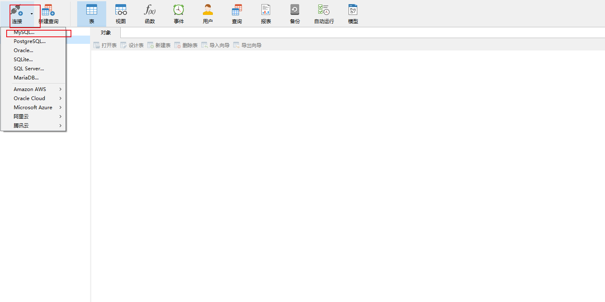
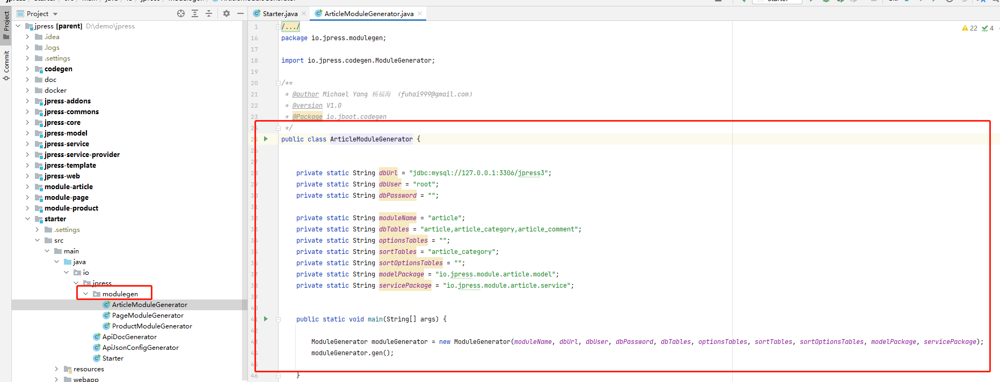
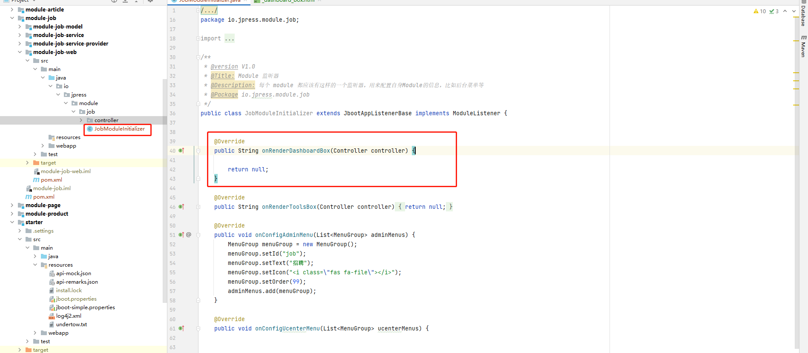
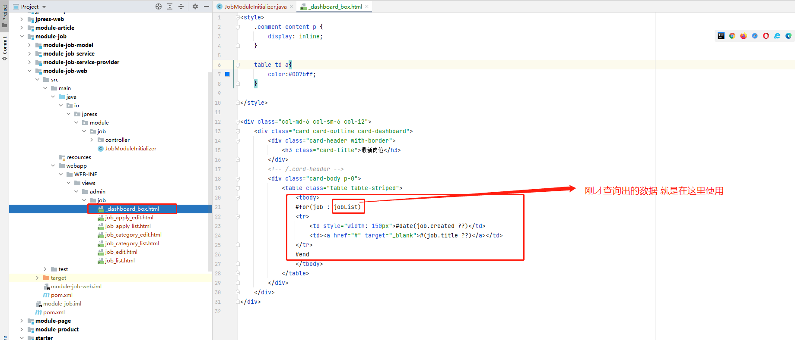
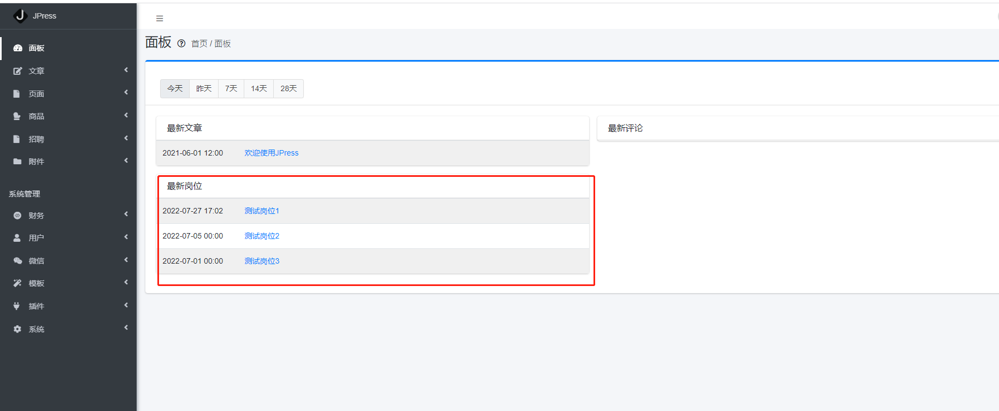
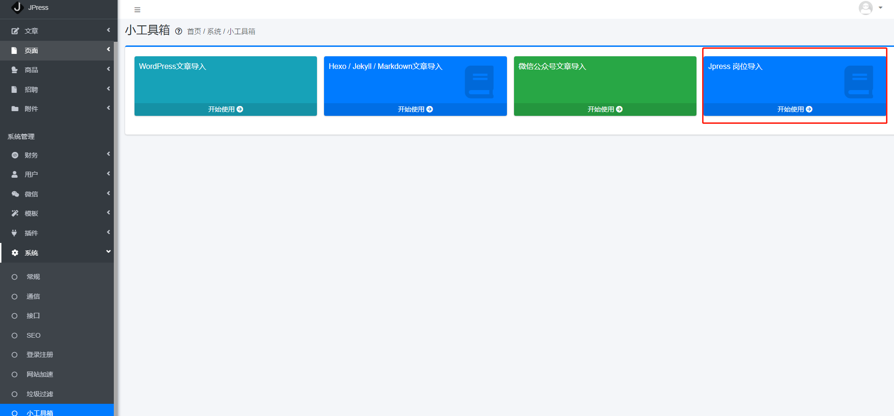

# JPress 模块开发

在开发开发之前，我们需要做好如下的准备：

- 1、下载源码。（文档地址：[jpress_download_source](/commons/jpress_download_source.md)）
- 2、导入源码到编辑器。（文档地址：[jpress_open_compiler](/commons/jpress_open_compiler.md)）
- 3、了解 JPress 如何编译并运行。（文档地址：[jpress_compile_with_run](/commons/jpress_compile_with_run.md)）


>为了方便文档讲解清楚模块开发，这里会有一个模拟模块开发的场景案例
> 
> 模块名称：招聘
> 
> 模块介绍：用于岗位数据管理的模块
> 
> 应用场景：用于发布岗位

招聘模块开发步骤：
 
* 1、表设计
 
* 2、使用模块代码生成器

* 3、模块导入编辑器
 
* 4、后台菜单配置

## 1、表设计
>在jpress编译和运行起来之后 已经在本地建库建表 那么我们使用数据库连接工具来连接上数据库 这里以 **Navicat** 为例 来演示

* 1、下载并安装 **Navicat** 数据库连接工具
  **Navicat下载连接：[https://www.navicat.com.cn/](https://www.navicat.com.cn/)**
  
* 2、打开 Navicat 软件 **点击左上角新建连接 选择 mysql**
  
  
* 3、输入对应的信息 点击确定即可 也可点击 连接测试 来测试是否可以连接成功
  
  
* 4、进入数据库
  


* 5、新建表

> **鼠标选择数据库中的表的选项->鼠标右键->新建表** 就会出现如图 右边的表的编辑页面
> 输入想要建立的表的信息 

  

* 6、保存表
> 编辑好表的信息之后 点击 左上角的保存按钮 然后输入 表名 点击确定即可 

  

* 7、查看表
> 保存好之后 我们就可以在数据库中 看到我们新建的表

  
  
## 2、模块代码生成器的使用

当表创建好以后 就需要使用 **模块的代码生成器 来生成表对应的基础代码**

* 1、来到编辑器 找到 **stater->src->main->java->io->jpress->modulegen** 这个包 **（在这个包下 放置了我们所有模块的 模块代码生成器 ）**

  

* 2、构建模块代码生成器

>既然要写新的模块 那么肯定需要构建新的 模块代码生成器 代码示例 如下所示

```java
public class JobModuleGenerator {


    private static String dbUrl = "jdbc:mysql://127.0.0.1:3306/jpress";
    private static String dbUser = "root";
    private static String dbPassword = "******";

    private static String moduleName = "job";
    private static String dbTables = "job,job_apply,job_category";
    private static String optionsTables = "job";
    private static String sortTables = "";
    private static String sortOptionsTables = "job_category";
    private static String modelPackage = "io.jpress.module.job.model";
    private static String servicePackage = "io.jpress.module.job.service";


    public static void main(String[] args) {

        ModuleGenerator moduleGenerator = new ModuleGenerator(moduleName, dbUrl, dbUser, dbPassword, dbTables, optionsTables,sortTables,sortOptionsTables, modelPackage, servicePackage);
        moduleGenerator.setGenUI(true).gen();

    }
}
```
> 模块构造器编写好之后 点击小箭头 运行

  

* 3、运行 模块代码生成器
> 点击运行之后 稍等一会 等待运行完毕 就可以看到 **项目中多出了 一个名为module-job的新模块** 
> 并且已经 **生成了 model service provider controller 以及 对应的 html页面 的基础代码**

  

## 3、模块导入编辑器
> 虽然新的 模块已经生成成功 但是可以看到 新的模块明显和其它的模块不一样 其他的模块 右下角都有一个蓝色的小方块
> 但是新的模块 没有 **这是因为 jpress 不能识别 此模块 那么怎么能让 jpress 识别此模块呢 ?**

  

* 1、将模块 依赖导入 jpress
  
> 然后我们就可以看到 jpress 已经可以识别此模块

  

* 2、使 jpress 能够识别 模块的 静态资源
>虽然此时 jpress 已经能够识别 新模块 但是新模块下的 html等资源 还是识别不到的
> 我们需要 找到 stater 下 的 pom.xml 文件  添加如下配置  就能使 jpress 识别到模块的 静态资源

  

## 4、后台菜单配置
> 此时 虽然 jpress 已经能够识别新的模块 但是我们在后台菜单中 依然是看不到 新的模块的

  

> 那么我们需要怎么做才能 使新的模块在后台菜单中呈现呢?

* 1、监听器配置 
> 首先 **在编辑器中 Job模块下的 module-job-web 模块 找到 模块对应的监听器（JobModuleInitializer）下的 onConfigAdminMenu方法** 设置好对应的 属性
> 代码示例 如下所示

```java
   @Override
    public void onConfigAdminMenu(List<MenuGroup> adminMenus) {
    
        MenuGroup menuGroup = new MenuGroup();
        menuGroup.setId("job");
        menuGroup.setText("招聘");
        menuGroup.setIcon("<i class=\"fas fa-file\"></i>");
        menuGroup.setOrder(99);
        adminMenus.add(menuGroup);
    }
```

  

* 2、使 jpress 启动时 能够识别 新模块
>接着 需要将 模块的依赖 引入 **jpress stater包下的 pom.xml 文件中**
> 
> **使 jpress 启动时 能够 识别并加载 新的模块** 代码示例如下所示

```xml
       <dependency>
            <groupId>io.jpress</groupId>
            <artifactId>module-job-web</artifactId>
            <version>4.0</version>
        </dependency>

        <dependency>
            <groupId>io.jpress</groupId>
            <artifactId>module-job-service-provider</artifactId>
            <version>4.0</version>
        </dependency>
```

  

* 3、重启项目
> 接着我们就可以重启项目 进入后台 然后就可以看到 新的模块 已经在后台菜单中呈现

  

## 面板配置
* 1、面板
>当刚进入后台的时候 我们默认的就是 进入面板的页面 而在这个页面中 除了有一篇 欢迎的文章外 什么都没有
> 但是  如果我们想在面板中 放一些东西 **比如:我们想把最新的岗位 也放到面板中**

  

* 2、添加数据
> 如果想要添加 数据到面板中 我们需要找到对应的 模块 中的 **JobModuleInitializer 类 -> onRenderDashboardBox()方法**

  

> 找到方法之后 我们需要在这个方法中 将数据查询出来 然后传递 那么这里就需要将 最新的岗位查出
> 
> 代码示例如下

```java
    @Override
    public String onRenderDashboardBox(Controller controller) {

        List<Job> jobList = Aop.get(JobService.class).findListByColumns(Columns.create(),"created desc",3);
        controller.setAttr("jobList",jobList);

        return "job/_dashboard_box.html";
    }
```

  

> 但是可以看到 这里返回的是 一个 html页面 那么这个html从哪里来?
> 
> **可以新建也可以使用已经有的html** 这里的 _dashboard_box.html 是新建一个 html文件
>
> html 示例如下
```html
<style>
    .comment-content p {
        display: inline;
    }

    table td a{
        color:#007bff;
    }

</style>

<div class="col-md-6 col-sm-6 col-12">
    <div class="card card-outline card-dashboard">
        <div class="card-header with-border">
            <h3 class="card-title">最新岗位</h3>
        </div>
        <!-- /.card-header -->
        <div class="card-body p-0">
            <table class="table table-striped">
                <tbody>
                #for(job : jobList)
                <tr>
                    <td style="width: 150px">#date(job.created ??)</td>
                    <td><a href="#" target="_blank">#(job.title ??)</a></td>
                </tr>
                #end
                </tbody>
            </table>
        </div>
    </div>
</div>
```

  

* 3、查看面板
> 此时 我们的所有操作 都已经完成 那么就可以进入后台查看 数据已经在面板中

  

## 工具箱配置
* 1、工具箱
> 可以看到 在后台 系统管理下 有个小工具箱 的选项 在工具箱中 有几个 已经存在了的 小工具

  

* 2、添加小工具
> 那么怎么添加 自己的工具呢?
> 
> 首先我们需要有一个对应的 html 文件 然后 需要找到对应的 模块 中的 **JobModuleInitializer 类 -> onRenderToolsBox()方法**
>
> html 示例如下

```html

<div class="col-lg-3 col-xs-6">
    <div class="small-box bg-blue">
        <div class="inner">
            <p>Jpress 岗位导入</p>
        </div>
        <div class="icon">
            <i class="fa fa-fw fa-book"></i>
        </div>
        <a href="#" class="small-box-footer">
            开始使用 <i class="fa fa-arrow-circle-right"></i>
        </a>
    </div>
</div>
```
  

> 如果页面中需要数据的话 可以查询数据并 设置数据 这里就直接返回

  

> 然后重启项目 并进入后台 查看工具箱 可以看到 工具已经添加成功

  