# Windows 上实现 undertow 部署

## 部署环境准备，jdk下载安装及配置

## 进入 Oracle官网 的 Java 界面
Oracle官网地址 [https://www.oracle.com/java/](https://www.oracle.com/java/)

### 1、JDK 下载

    1.1 在网站页面滚动鼠标下拉定位到 Java，选择 Oracle JDK

    1.2 选择 Java archive，再滚动鼠标下拉，选择 Java SE 8 (8u202 and earlier)

    1.3 选择你需要下载的 jdk-8u202-windows-x64.exe

### 2、JDK安装

    2.1 下载完 JDK 到本地后，找到该文件，双击运行 JDK 安装程序

    2.2 等待一会，进入 JDK 安装界面，点击下一步

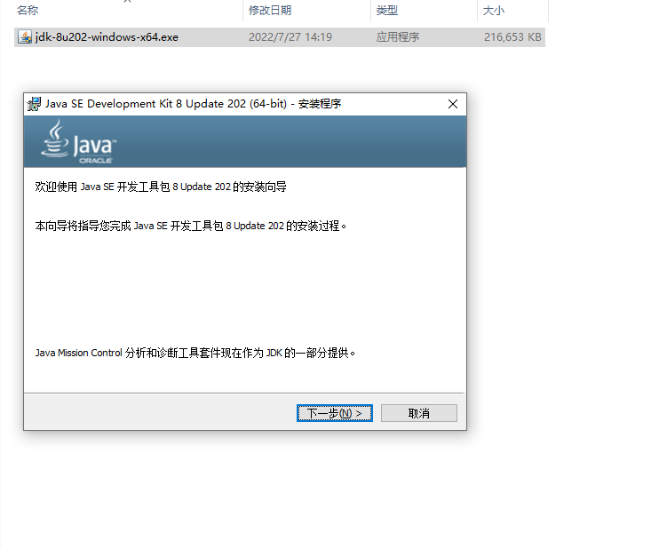

    2.3 安装位置可以默认，也可以选择自己想要存放的位置，然后一直点击下一步直到完成即可。

### 3、配置环境变量

    3.1 首先在电脑左下角搜索框搜索控制面板并打开。

    3.2 之后打开系统与安全面板下面的系统菜单。

    3.3 接着打开高级系统设置弹窗里面的高级-环境变量即可。

    3.4 新建环境变量，变量名为 JAVA_HOME，变量值为刚刚 JDK 安装的路径，点击确定

    3.5  双击 path，进入界面后，点击编辑文本

### 4、 验证 jdk 是否配置成功

    4.1 按 win+r 快捷键 打开命令窗口，输入 cmd 指令，点击确定

    4.2 输入指令：java -version，可以查看到安装的 jdk 版本则成功。

## undertow 部署项目

### 1、部署

    1.1 项目打包，输入指令：mvn clean package

    1.2 项目打包后生成的压缩包：start -> target -> starter-4.0.zip

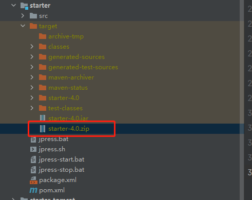

    1.3 
        找到压缩包在 Windows 的位置：
        鼠标选中压缩包，单击右键选择 Open In -> Explorer，
        如下图所示：

    1.4 新建文件夹存放压缩包，并解压缩

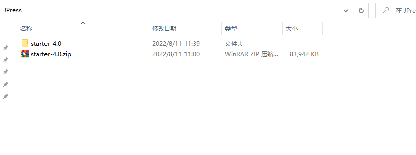

    1.4 进入解压后的文件

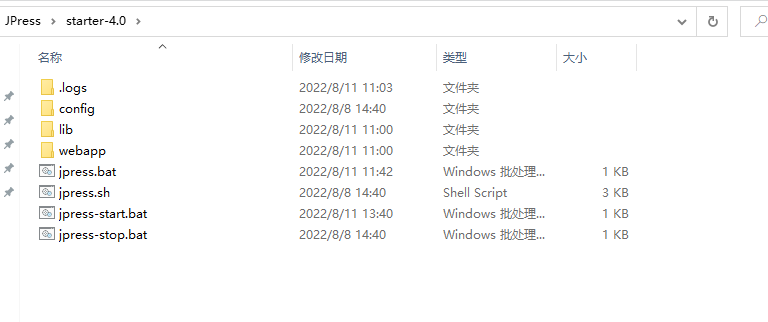

    1.5 输入 cmd 指令，按下回车键，进入命令界面，如下三图所示：

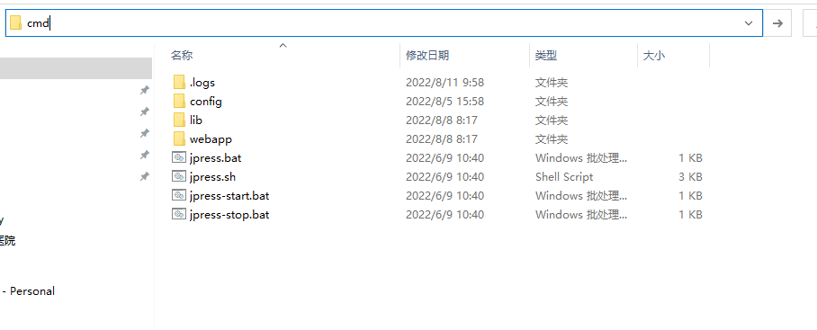

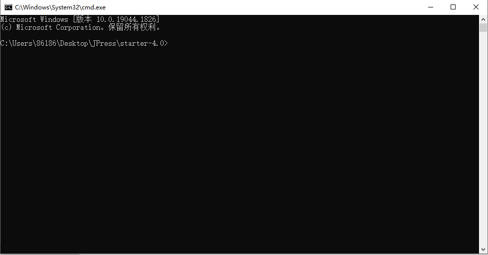

    1.6 启动项目，输入指令：jpress.bat start，按下回车键

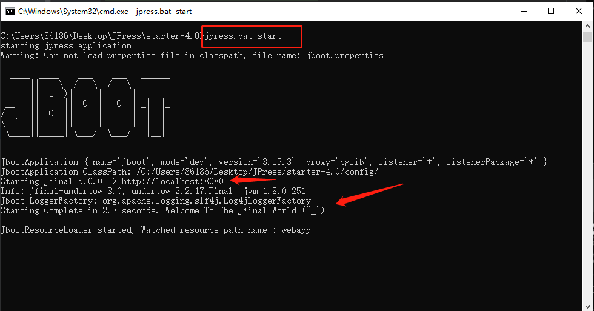

    1.7 关闭启动界面后，项目停止
        配置后台启动，输入指令：start /b  jpress.bat start
        这个后台启动指的是，你可以继续在命令界面进行其他操作，关闭界面，项目会停止

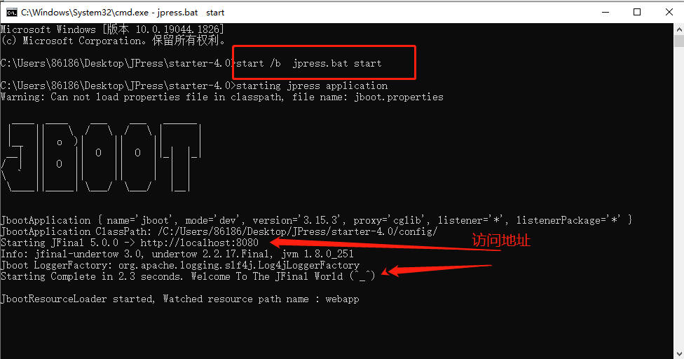

    1.8 浏览器访问

    1.9 要进行接下来的操作，
        Windows 要安装 mysql 5.7 数据库，MySQL 下载安装（略）

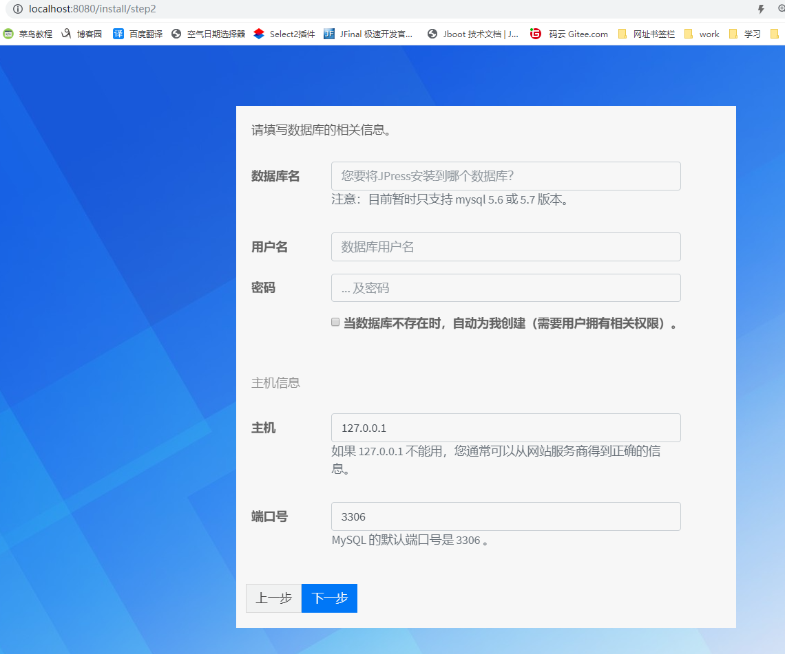

    1.10 配置后台启动，关闭命令界面，项目照常运行
        找到解压缩包下的文件：jpress-start.bat

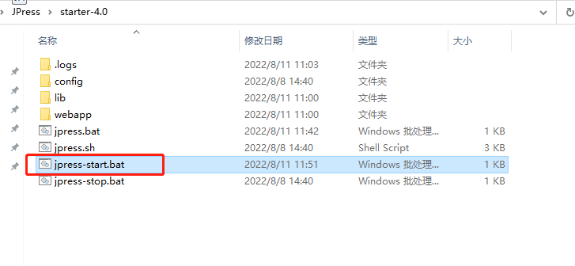

    1.11 鼠标选中 jpress-start.bat 单击右键，选择编辑，进入编辑页面
        添加以下代码，保存关闭：

        @echo off
        if "%1"=="h" goto begin
        start mshta vbscript:createobject("wscript.shell").run("""%~nx0"" h",0)(window.close)&&exit
        :begin

        如下图所示：

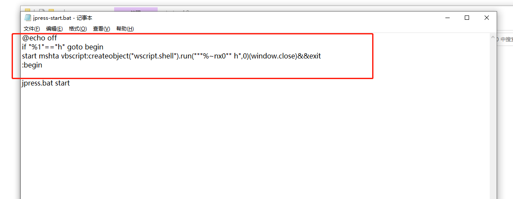

    1.12 鼠标双击 jpress-start.bat 启动项目
         鼠标双击 jpress-stop.bat 停止项目

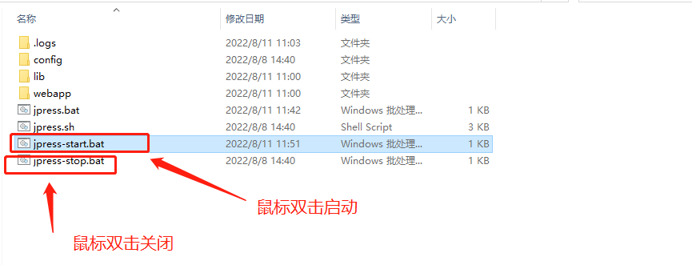

    1.13 配置启动项目后，打开浏览器进入指定网址页面，如下图所示：
        编辑 jpress-start.bat 文件
        输入：start ChromeCore.exe -k "http://localhost:8080" 

        ChromeCore.exe：Windows 安装的浏览器程序
        http://localhost:8080 ：指定的网址

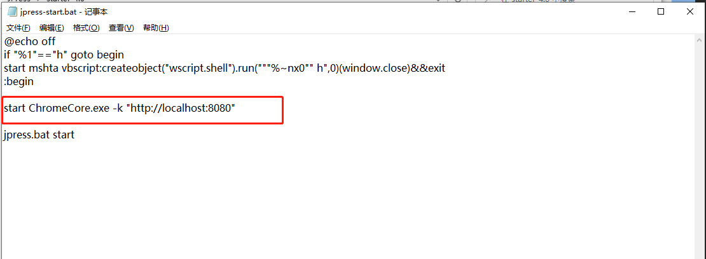 

    双击 jpress-start.bat 启动项目后，打开浏览器

