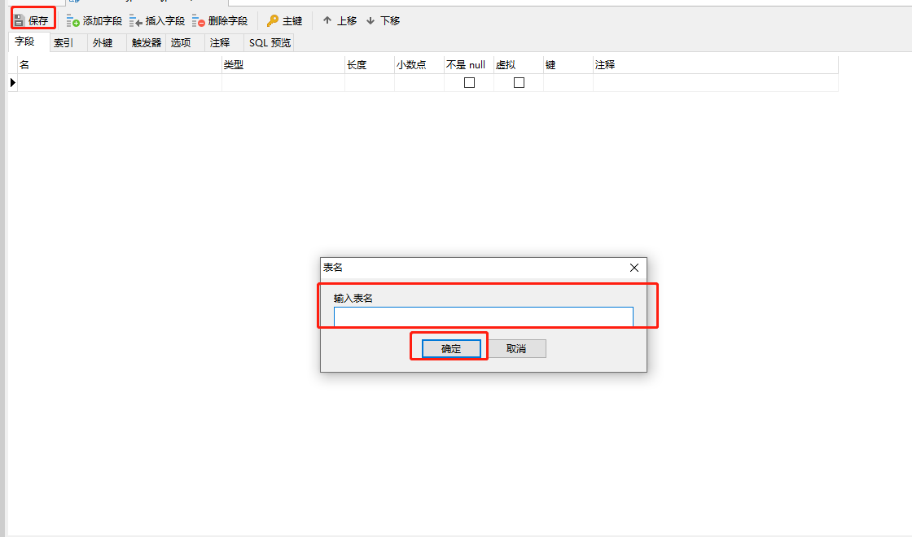

# jpress 模板二次开发

## 1-源码下载
> 请查看 [jpress源码获取文档](xxxxxxxxx)

## 2-导入源码到编辑器
> 请查看 [jpress导入源码到编辑器文档](xxxxxxxxx)

## 3-编译并运行
> 请查看 [jpress编译和运行文档](xxxxxxxxx)

## 4-数据库设计
>在jpress编译和运行起来之后 已经在本地建库建表 那么我们使用数据库连接工具来连接上数据库 这里以 **Navicat** 为例 来演示

* 1-下载并安装 **Navicat** 数据库连接工具
  [Navicat下载连接](https://www.navicat.com.cn/)
  
* 2-打开 Navicat 软件 **点击左上角新建连接 选择 mysql**
  
  
* 3-输入对应的信息 点击确定即可 也可点击 连接测试 来测试是否可以连接成功
  
  
* 4-进入数据库
  

* 5-新建表 
> 比如我们想新建 一个模块 那么首先 要从新模块的表的建立 开始
> 这里我以 招聘模块 为例子 来做演示

> **鼠标选择数据库中的表的选项->鼠标反手键->新建表** 就会出现如图 右边的表的编辑页面
> 输入想要建立的表的信息 

  

* 6-保存表
> 编号好表的信息之后 点击 左上角的保存按钮 然后输入 表名 点击确定即可 
  

* 7-查看表
> 保存好之后 我们就可以在数据库中 看到我们新建的表

  
  
## 5-模块代码生成器的使用
   //TODO                              