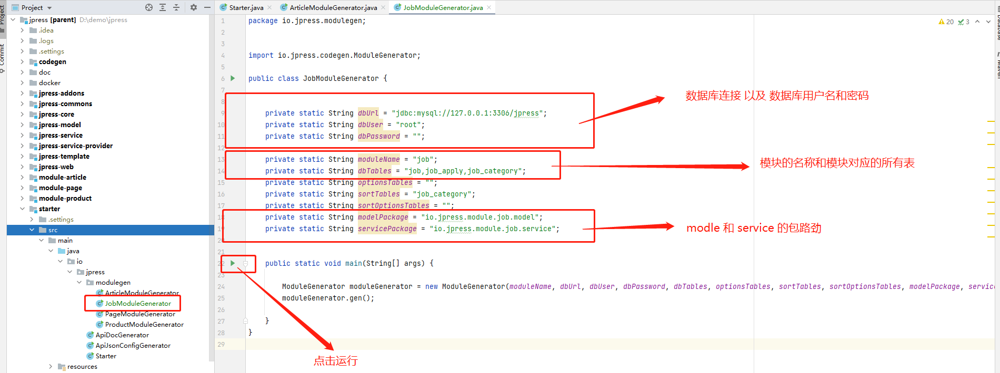
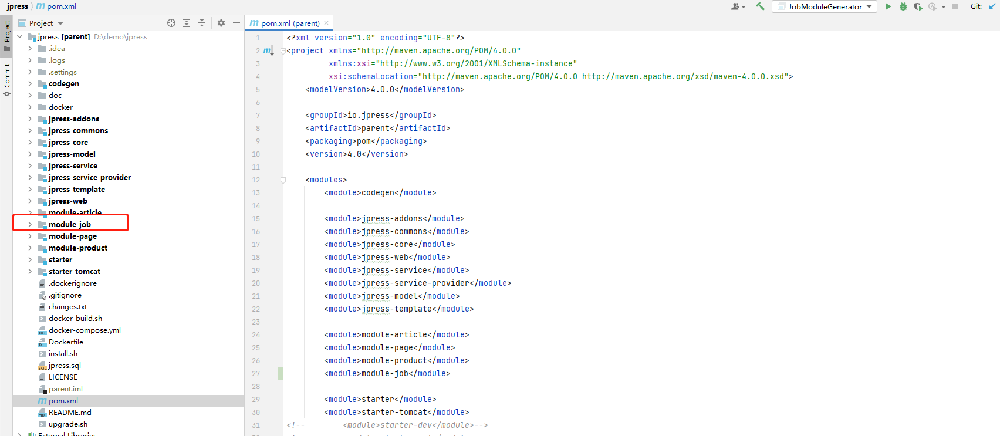
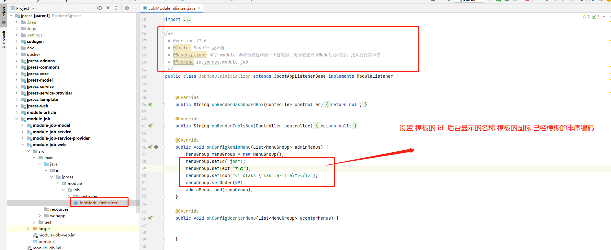
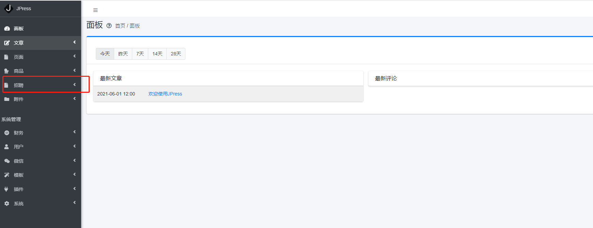
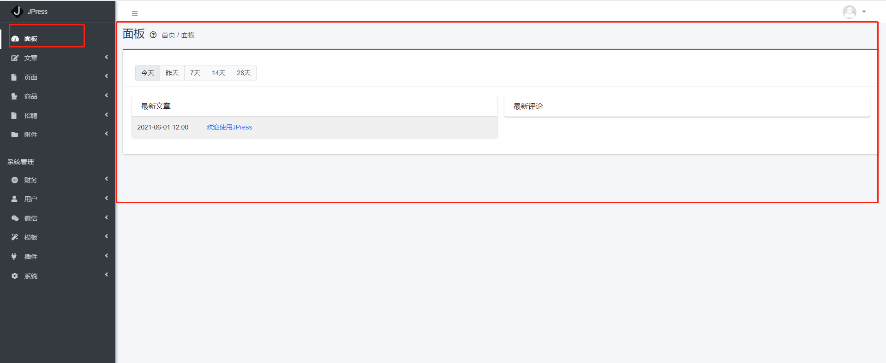
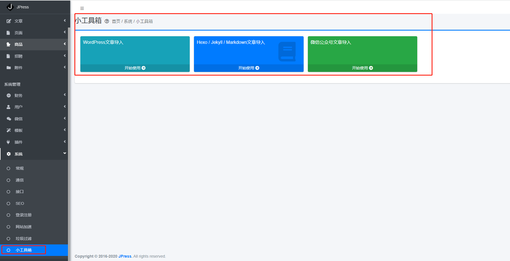
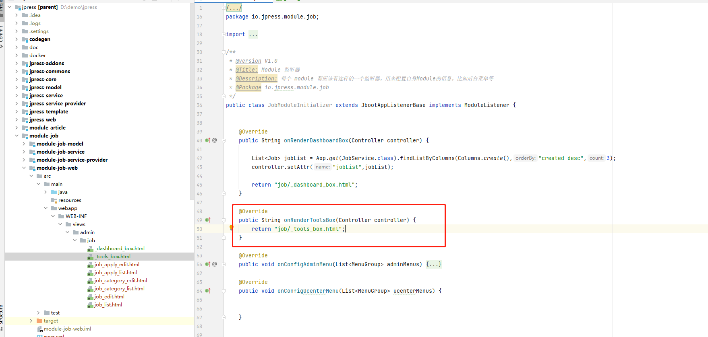

# jpress 模板二次开发

## 1-源码下载
> 请查看 [jpress源码获取文档](xxxxxxxxx)

## 2-导入源码到编辑器
> 请查看 [jpress导入源码到编辑器文档](xxxxxxxxx)

## 3-编译并运行
> 请查看 [jpress编译和运行文档](xxxxxxxxx)

## 4-数据库设计
>在jpress编译和运行起来之后 已经在本地建库建表 那么我们使用数据库连接工具来连接上数据库 这里以 **Navicat** 为例 来演示

* 1-下载并安装 **Navicat** 数据库连接工具
  [Navicat下载连接](https://www.navicat.com.cn/)
  
* 2-打开 Navicat 软件 **点击左上角新建连接 选择 mysql**
  
  
* 3-输入对应的信息 点击确定即可 也可点击 连接测试 来测试是否可以连接成功
  
  
* 4-进入数据库
  

* 5-新建表 
> 比如我们想新建 一个模块 那么首先 要从新模块的表的建立 开始
> 这里我以 招聘模块 为例子 来做演示

> **鼠标选择数据库中的表的选项->鼠标反手键->新建表** 就会出现如图 右边的表的编辑页面
> 输入想要建立的表的信息 

  

* 6-保存表
> 编辑好表的信息之后 点击 左上角的保存按钮 然后输入 表名 点击确定即可 
  

* 7-查看表
> 保存好之后 我们就可以在数据库中 看到我们新建的表

  
  
## 5-模块代码生成器的使用
> 当表创建好以后 就需要使用 **模块的代码生成器 来生成表对应的基础代码**

* 1-来到编辑器 找到 **stater->src->main->java->io->jpress->modulegen** 这个包
>在这个包下 放置了我们所有模块的 模块代码生成器 

  

* 2-构建模块代码生成器
> 既然要写新的模块 那么肯定需要构建新的 模块代码生成器
> 模块构造器编写好之后 点击小箭头 运行

  

* 3-运行 模块代码生成器
> 点击运行之后 稍等一会 等待运行完毕 就可以看到 **项目中多出了 一个名为module-job的新模块** 
> 并且已经**生成了 model service provider controller 以及 对应的 html页面 的基础代码**

  

## 6-模块导入编辑器
> 虽然新的 模块已经生成成功 但是可以看到 新的模块明显和其它的模块不一样 其他的模块 右下角都有一个蓝色的小方块
> 但是新的模块 没有 **这是因为 jpress 不能识别 此模块 那么怎么能让 jpress 识别此模块呢 ?**

  

* 1-将模块 依赖导入 jpress
  
> 然后我们就可以看到 jpress 已经可以识别此模块

  

* 2-使 jpress 能够识别 模块的 静态资源
>虽然此时 jpress 已经能够识别 新模块 但是新模块下的 html等资源 还是识别不到的
> 我们需要 找到 stater 下 的 pom.xml 文件  添加如下配置  就能使 jpress 识别到模块的 静态资源

  

## 7-后台菜单配置
> 此时 虽然 jpress 已经能够识别新的模块 但是我们在后台菜单中 依然是看不到 新的模块的

  

> 那么我们需要怎么做才能 使新的模块在后台菜单中呈现呢?

* 1-监听器配置 
> 首先 **在编辑器中 新模块下的 web 模块 找到 模块对应的监听器** 设置好对应的 属性

  

* 2-使 jpress 启动时 能够识别 新模块
>接着 需要将 模块的依赖 引入 **jpress stater包下的 pom.xml 文件中**
> 
> **使 jpress 启动时 能够 识别并加载 新的模块**

  

* 3-重启项目
> 接着我们就可以重启项目 进入后台 然后就可以看到 新的模块 已经在后台菜单中呈现

  

## 8-面板配置
* 1-面板
>当刚进入后台的时候 我们默认的就是 进入面板的页面 而在这个页面中 除了有一篇 欢迎的文章外 什么都没有
> 但是  如果我们想在面板中 放一些东西 **比如:我们想把最新的岗位 也放到面板中**

  

* 2-添加数据
> 如果想要添加 数据到面板中 我们需要找到对应的 模块 中的 **JobModuleInitializer 类 -> onRenderDashboardBox()方法**

  

> 找到方法之后 我们需要在这个方法中 将数据查询出来 然后传递 那么这里就需要将 最新的岗位查出

  

> 但是可以看到 这里返回的是 一个 html页面 那么这个html从哪里来?
> 
> **可以新建也可以使用已经有的html** 这里的 _dashboard_box.html 是新建一个 html文件

  

* 3-查看面板
> 此时 我们的所有操作 都已经完成 那么就可以进入后台查看 数据已经在面板中

  

## 9-工具箱配置
* 1-工具箱
> 可以看到 在后台 系统管理下 有个小工具箱 的选项 在工具箱中 有几个 已经存在了的 小工具

  

* 2-添加小工具
> 那么怎么添加 自己的工具呢?
> 
> 首先我们需要有一个对应的 html 文件 然后 需要找到对应的 模块 中的 **JobModuleInitializer 类 -> onRenderToolsBox()方法**
 
  

> 如果页面中需要数据的话 可以查询数据并 设置数据 这里就直接返回

  

> 然后重启项目 并进入后台 查看工具箱 可以看到 工具已经添加成功

  