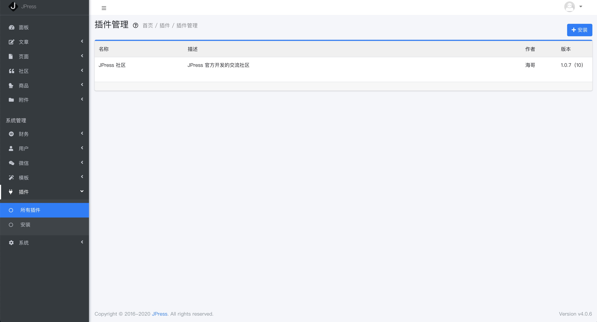

# Plug-in

[[toc]]

## Explain

The plug-in is an extension of the website function. For example, if the user pays attention to the function of the public account login, it can be implemented through the plug-in.
In addition, there are task treasure plugins, live code plug-ins.

