# 云服务器 CentOS7 操作系统上 Tomcat 部署项目

## 1、xShell 和 xftp 下载安装（略）

xShell 和 xftp 下载地址：[https://www.xshell.com/zh/free-for-home-school/](https://www.xshell.com/zh/free-for-home-school/)

## 2、xftp 连接云服务器

    2.1 xftp 新建连接 

    
    2.2 连接会话属性
    名称：自定义
    主机：云服务器公网IP

    上图中的用户名和密码，在两种地方可以设置
    (1)更换操作系统时，如下图所属：

    (2)对云服务器的实例操作：管理-->重置实例密码
    如下图所示：

    (3)数据填写完毕，最后点击确定，弹出会话列表
    选择你添加的会话，点击连接，如下图所示：

    连接成功

## 3、JDK 压缩包下载

    3.1 下载 jdk1.8 
        注：此处 CentOS7 是64位，所以下载的是：Linux x64， 文件类型为 tar.gz 的文件

JDK 官网地址：[https://www.oracle.com/java/](https://www.oracle.com/java/)

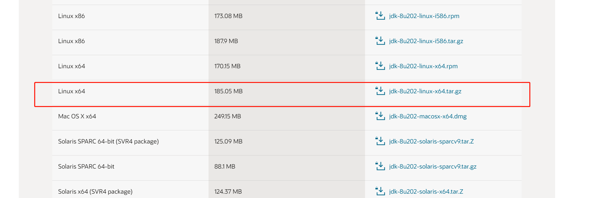

    3.2 xftp 界面，找到 Windows 桌面上下载好的 jdk1.8 的压缩包，
        把 jdk 压缩包拖动到云服务器界面，直接鼠标选中文件拖动即可
        如下图所示：

    3.3 xShell 连接云服务器，找到 jdk1.8 所在的位置
        输入指令：tar -xvf jdk-8u202-linux-x64.tar.gz 解压 jdk 压缩包

    3.4 配置 jdk 环境
    输入指令：vim /etc/profile，进入编辑页面，输入 i 开始编辑

    在最后一行加上环境：
    #set java enviroment
    JAVA_HOME=/usr/local/jdk/jdk1.8 
    CLASSPATH=.:$JAVA_HOME/lib.tools.jar
    PATH=$JAVA_HOME/bin:$PATH
    export JAVA_HOME CLASSPATH PATH
    
    JAVA_HOME= jdk 的安装路径
    编辑完毕，按下键盘的 Esc 退出编辑模式，再输入 ：wq 保存并退出
    如下图所示：

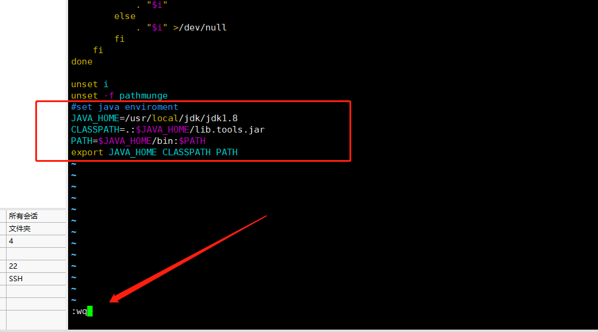

    3.5 检查 jdk 是否安装成功
        编辑完保存退出
        先输入指令：source /etc/profile
        再输入指令：java -version

## 4、Tomcat 压缩包下载

    4.1 tomcat 下载，以 apache-tomcat-9.0.65.tar 为例
下载地址[https://tomcat.apache.org/download-90.cgi](https://tomcat.apache.org/download-90.cgi)

    4.2 在 xftp 界面找到 Windows 桌面下载好的 tomcat 压缩包，
        把 tomcat 压缩包拖动到云服务器界面，直接鼠标选中文件拖动即可
        如下图所示：    

    4.3 xShell 连接云服务器
        输入指令：tar -xvf apache-tomcat-9.0.65.tar.gz 解压 tomcat 压缩包

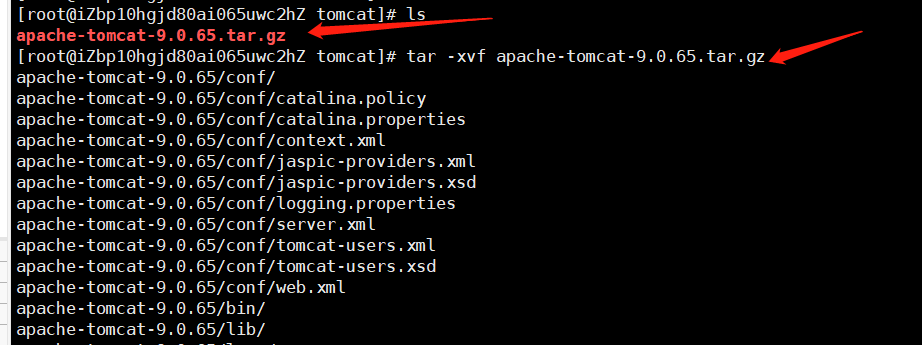

    4.4 开放 8080 端口
    

    4.5 启动tomcat
        进入 tomcat 的 bin 目录
        输入指令： ./startup.sh 启动

    4.6 测试是否启动成功，在浏览器中输入：云服务器公网IP:8080
        如下图所示：

## 5、linux 中 mysql 下载安装

    5.1 输入指令：rpm -qa | grep mysql
        查看是否安装过 mysql

    5.2 下载安装mysql的repo源
        CentOS 7的yum源中默认是没有mysql的。
        所以，为了解决这个问题我们首先下载安装mysql的repo源。
        输入指令：wget http://repo.mysql.com//mysql57-community-release-el7-7.noarch.rpm

    5.3 安装mysql的repo源
        输入指令：rpm -ivh mysql57-community-release-el7-7.noarch.rpm

    安装之后会获得 /etc/yum.repos.d/mysql-community.repo
    和 /etc/yum.repos.d/mysql-community-source.repo 两个源，  
    可以去相应的路径下查看一下。

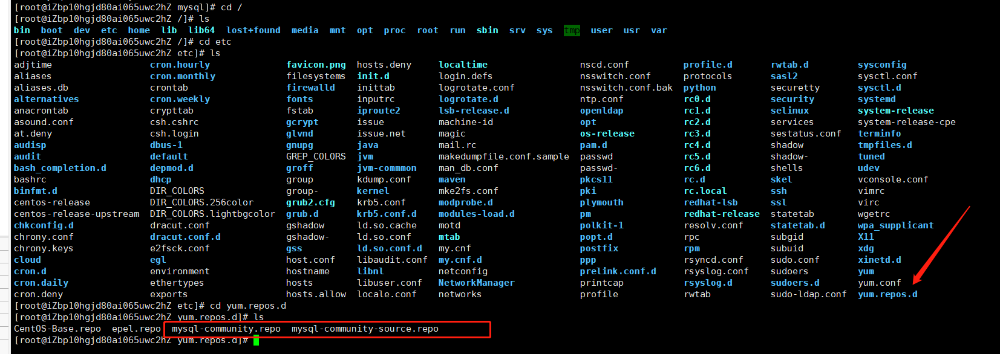

    5.4 安装 mysql
        输入指令：yum install mysql-server
        问题需要输入：输入 y 

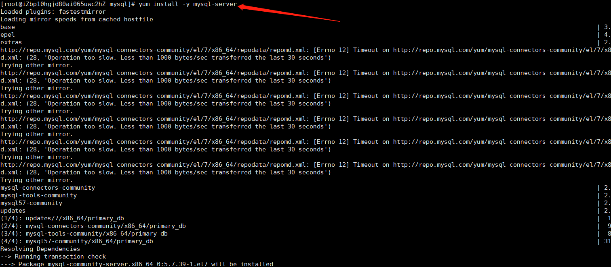

    5.5 安装 mysql 遇到问题：
        （1）报错：Failing package is: mysql-community-libs-compat-5.7.39-1.el7.x86_64
                GPG Keys are configured as: file:///etc/pki/rpm-gpg/RPM-GPG-KEY-mysql
        
            解决办法：执行指令 rpm --import https://repo.mysql.com/RPM-GPG-KEY-mysql-2022

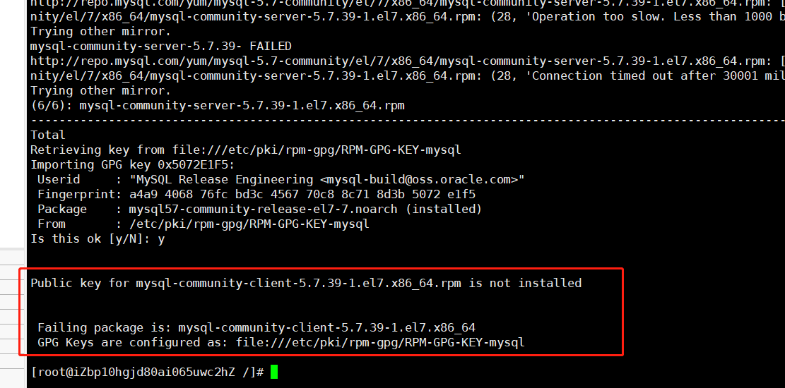

        再重新执行安装指令：yum install mysql-server
        安装成功

        （2）报错：Failed to start mysqld.service: Unit not found.
            
            解决办法：执行指令 yum install -y mysql-server
        
        （3）报错：ERROR 1045 (28000): Access denied for user 'root'@'localhost' (using password: YES)
            密码错误，执行查看密码指令
        
        解决办法：
        （4）查看密码：grep 'temporary password' /var/log/mysqld.log
        
            2022-08-05T01:40:27.650536Z 1 [Note] A temporary password is generated for root@localhost: tbTmxl:xa1-l
            初始密码在 “root@localhost:“之后。
        
        
        （5）更改密码：指令 mysql_secure_installation   

            报错：不合符密码策略 Failed! Error: Your password does not satisfy the current policy requirements
            新密码要符合策略：大写字母 + 小写字母 + 特殊字符 + 数字

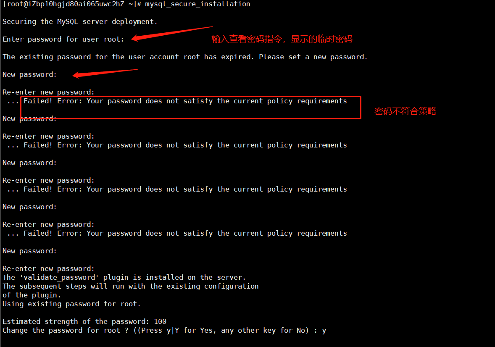

        5.6 启动 mysql，输入指令：service mysqld start
        输入查看临时密码指令：grep 'temporary password' /var/log/mysqld.log
        2022-08-05T01:40:27.650536Z 1 [Note] A temporary password is generated for root@localhost: tbTmxl:xa1-l
        初始密码在 “root@localhost:“之后。
        更改密码：指令 mysql_secure_installation（新密码要符合策略：大写字母 + 小写字母 + 特殊字符 + 数字）
        如下图所示：

        5.7 安装配置成功，如下图所示：

   

        5.8 本地连接云服务器的 mysql 失败

        （1）云服务器开放 3306 端口

        （2）登录 mysql
            输入指令 select user ,host from mysql.user; 查看用户访问权限
            
        （3）开放用户的访问权限
            使用如下命令将所需要开放的用户的访问权限改为任意：
            GRANT ALL PRIVILEGES ON *.* TO 'root'@'%' IDENTIFIED BY '*********' WITH GRANT OPTION;
            注意：这里的密码需要最短为8位，而且最好同时有大写字母、小写字母、数字、特殊符号否则可能通不过 密码强度校验而报错。
            也可以使用set global validate_password_policy=0;命令临时去掉密码强度校验
            如下图所示：

        （4）本地连接云服务器 mysql 成功
            主机：云服务器公网 IP

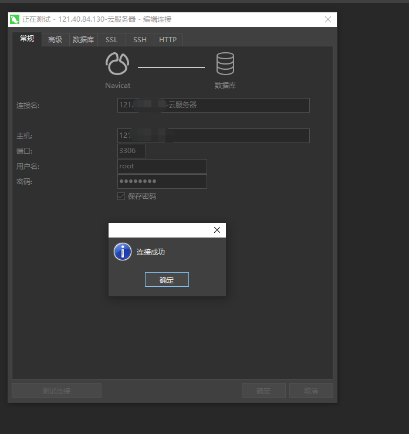

        5.9 在云服务器的 mysql 中创建新的数据库
            鼠标右键点击本地连接的云服务器 mysql，再选择新建数据库
            如下图所示：

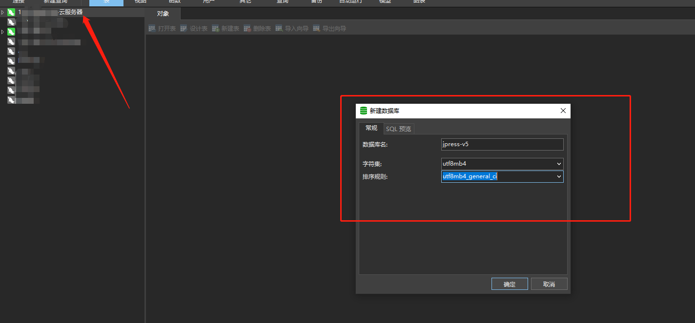

        5.10 导入数据库文件
            鼠标右键点击创建的数据库
            点击: 运行SQL文件...
            如下图所示：

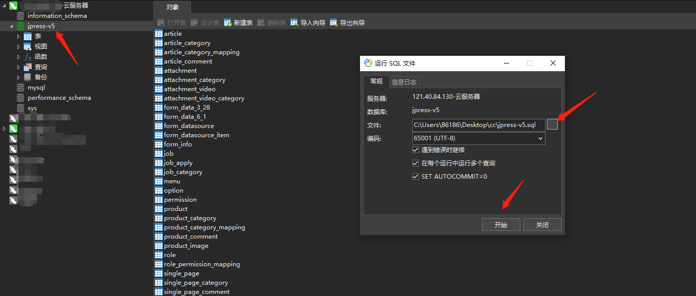

## 6、云服务器 tomcat 部署项目

    6.1 项目打war包
        注：打包之前要修改配置文件中的 
        start->src->main->resources->jboot.properties-> jboot.datasource.url
        jboot.datasource.url=jdbc\:mysql\://云服务器公网 IP\:服务器开放的 mysql 端口号/要连接的数据库名称?useSSL\=false&characterEncoding\=utf8&zeroDateTimeBehavior\=convertToNull
        示例：jboot.datasource.url=jdbc\:mysql\://192.168.30.666\:3306/jpress-v5?useSSL\=false&characterEncoding\=utf8&zeroDateTimeBehavior\=convertToNull

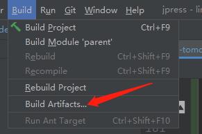

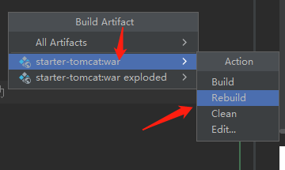

    6.2 打包完成后，通过 xftp 把本地的 war 包上传到 tomcat 的 weapps 目录下
        如下图所示：

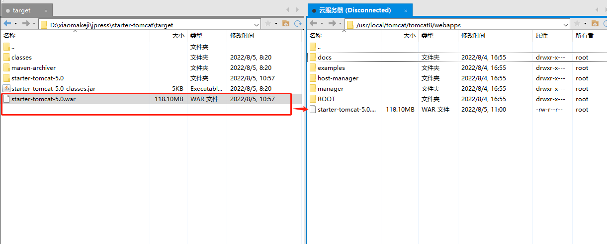

    6.3 测试是否部署成功
        进入 tomcat 的 bin 目录
        输入指令： ./startup.sh 启动
        注：要关闭防火墙
        查看防火墙咋状态：sudo systemctl status firewalld
        打开后重启会恢复回原来的状态，命令为：sudo systemctl start firewalld；
        打开后重启不会恢复到原来的状态，命令为：sudo systemctl enable firewalld
        关闭后重启会恢复回原来的状态，命令为：sudo systemctl stop firewalld
        关闭后重启不会恢复到原来的状态，命令为：sudo systemctl disable firewalld。
        
        在浏览器中输入：云服务器公网 IP：8080/war 包的名字
        示例：120.40.80.130：8080/starter-tomcat-5.0
        如下图所示：

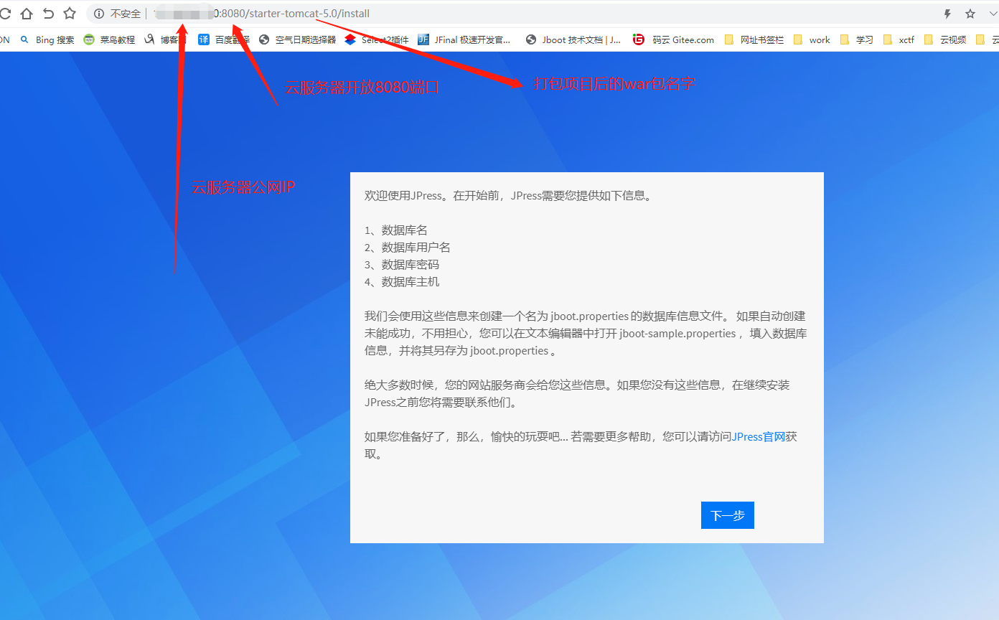

