## Maven 下载及配置

###1.Maven 下载
Maven官网地址：[https://maven.apache.org/download.cgi](https://maven.apache.org/download.cgi)

    1.1 进入Maven官网，点击 archives 
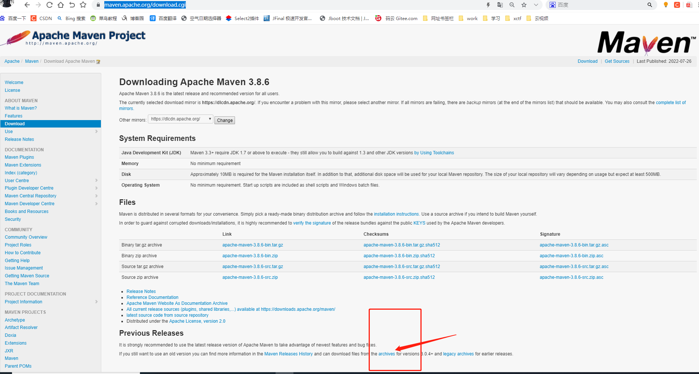

    1.2 选择你需要的版本点击下载，此处以3.6.2示例

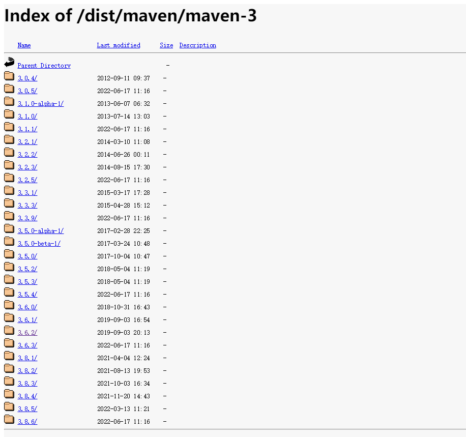

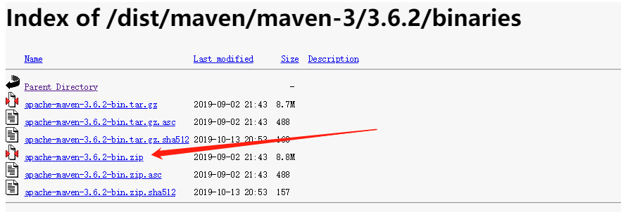

    1.3 找到下载的压缩包，并解压

###2.配置环境变量

    2.1 首先在电脑左下角搜索框搜索控制面板并打开。

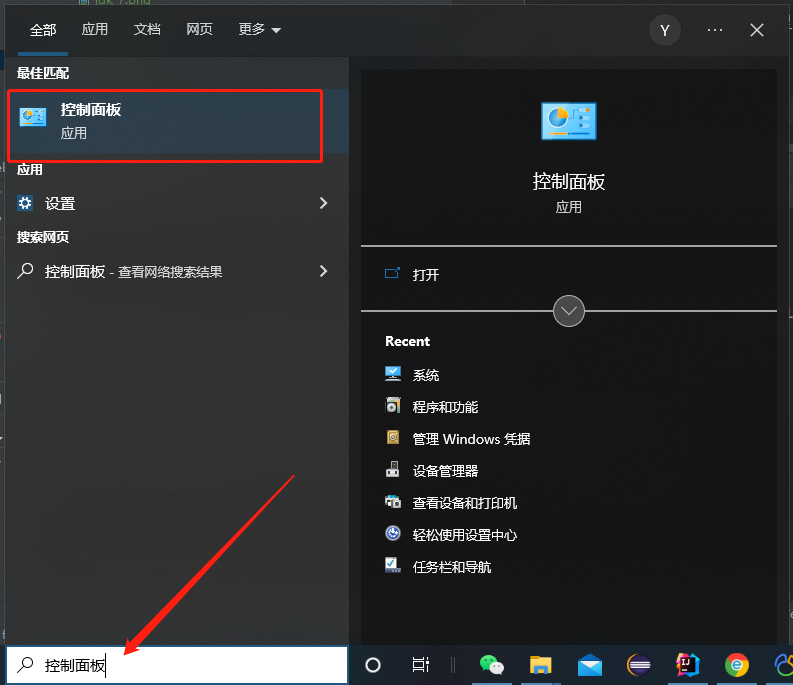

    2.2 之后打开系统与安全面板下面的系统菜单。

    2.3 接着打开高级系统设置弹窗里面的高级-环境变量即可。

    2.4 新建环境变量，变量名为MAVEN_HOME,变量值为刚刚maven解压后所在的路径，点击确定

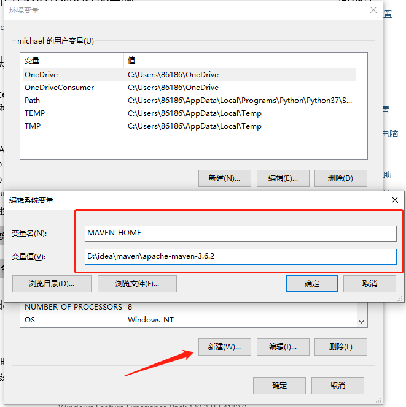

    2.5  双击path，进入界面后，点击编辑文本

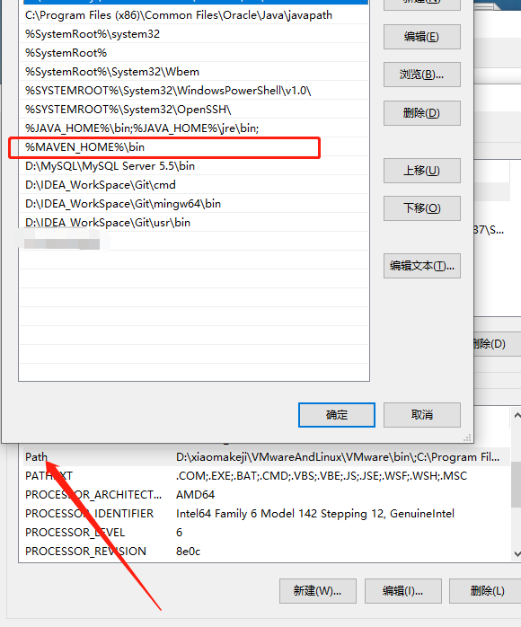

###3. 验证maven是否安装配置成功

    3.1 按win+r 快捷键 打开命令窗口，输入cmd指令，点击确定

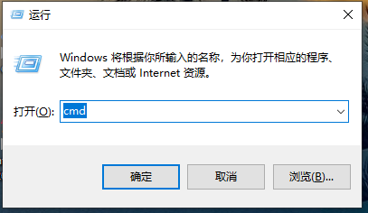

    3.2 输入指令 mvn -version，可以查看到安装的maven版本，则安装配置成功。

    3.3 setting文件配置，自定义maven仓库（如果不自定义有默认的仓库）
        在一个磁盘中创建一个文件夹，取名maven_repository(可以自定义根据自己的习惯起名)。

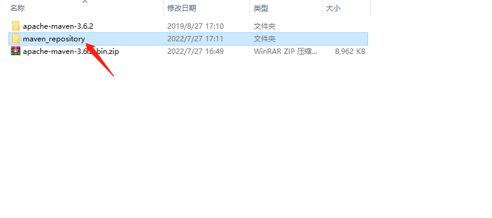

    3.4 打开maven的安装目录，选择conf文件夹中的setting.xml文件

    3.5 修改文件settings.xml
        找到settings.xml中的localRepository配置，修改成创建的maven_repository文件夹的目录。如：D:\idea\maven\maven_repository

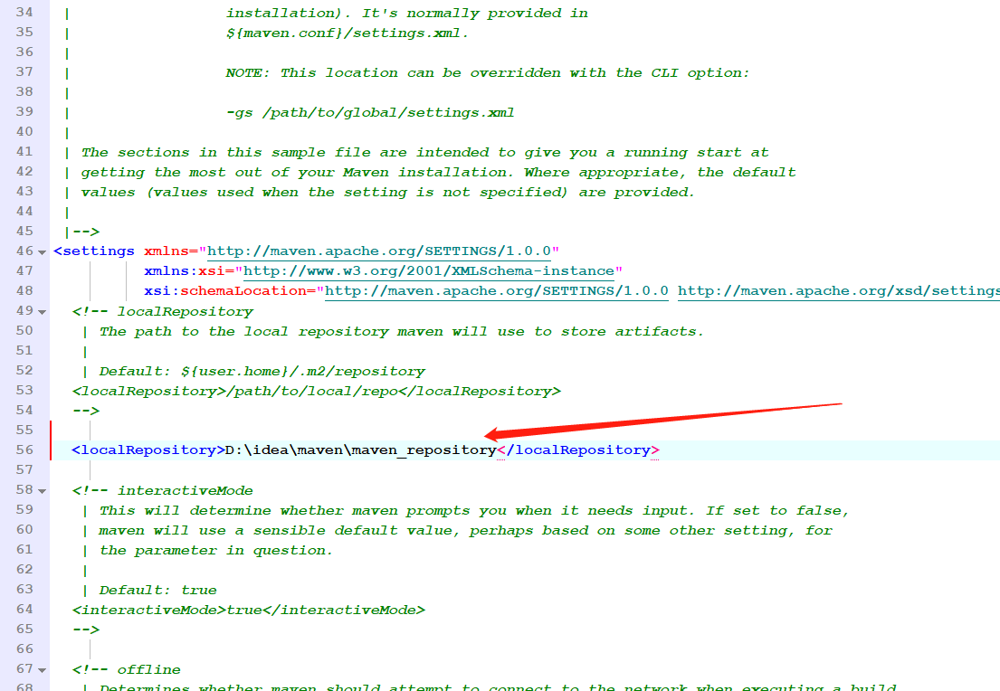

    3.6 检验下是否已经设置成功
        控制台输入 mvn help:system，

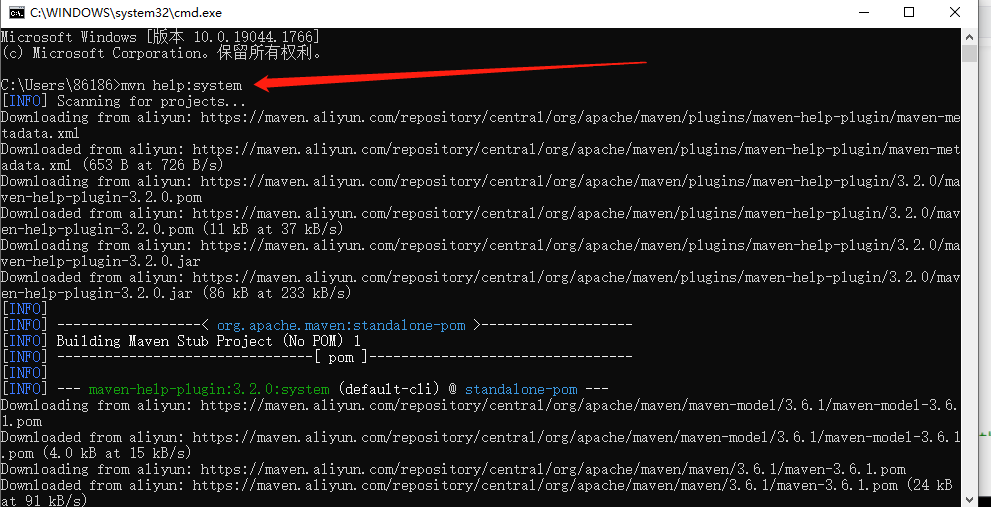

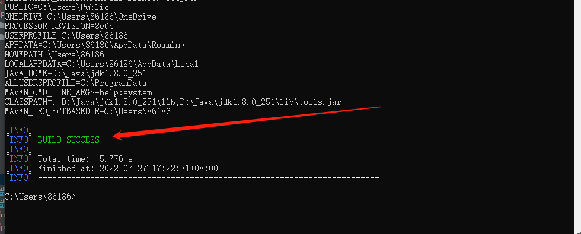

        出现BUILD SUCCESS 说明执行成功
        找到新建的maven_repository文件夹查看里面是否有“org”文件夹
        如果里面生成文件，即说明修改成功。

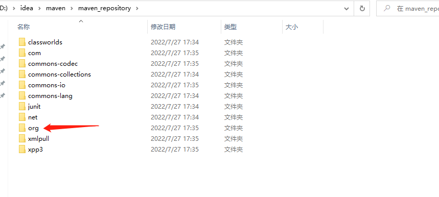

    3.7 修改Maven的下载镜像地址为阿里源
        安装好Maven时，要及时的修改Maven下载的镜像地址，最好改为国内的下载镜像，例如阿里云中央仓库，华为云中央仓库。
        这里添加的是阿里云中央镜像

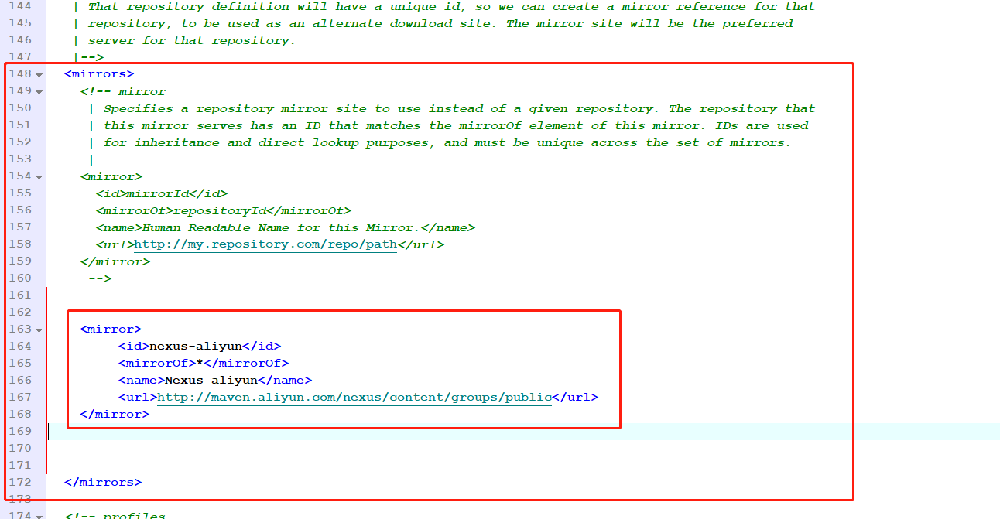

###4. maven在IDEA中的配置

    4.1 打开idea中File-setting

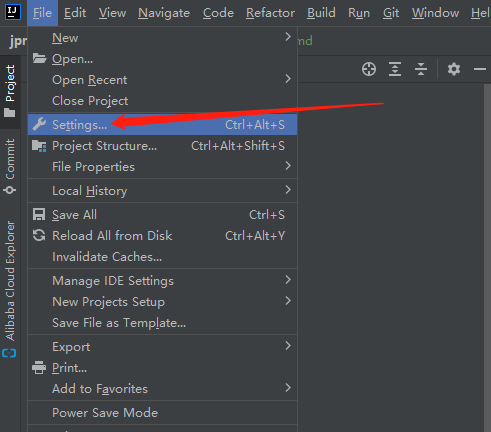

    4.2 配置maven

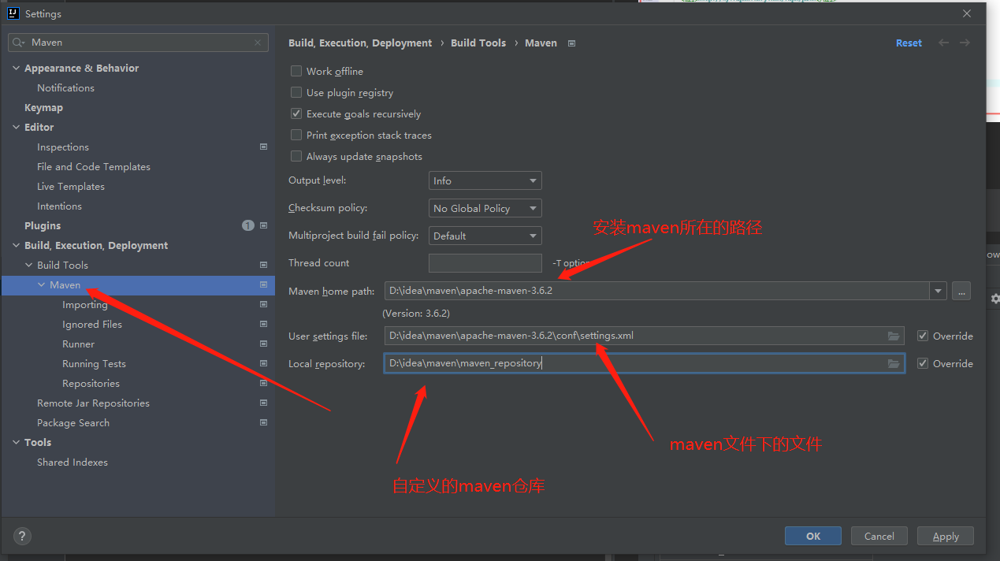

