# Tomcat 部署

## 部署环境：jdk1.8，Tomcat9，mysql5.7

## jdk 下载安装及配置

jdk 官网地址： [https://www.oracle.com/java/](https://www.oracle.com/java/)

### 1、jdk 下载

进入官网，定位到：Java -> Java SE -> Oracle JDK 点击进入，如下图所示：

选择 Java archive，再鼠标下拉页面，选择 Java SE 8 (8u202 and earlier)

下载 jdk-8u202-windows-x64.exe

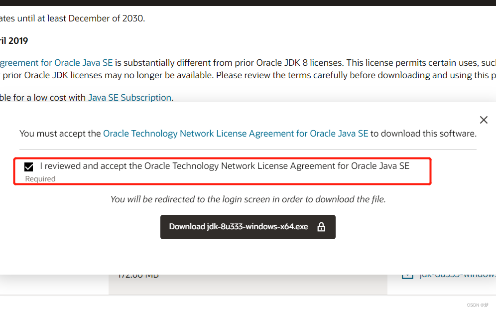

### 2、jdk 安装

下载 jdk 到本地，找到该文件，鼠标双击 .exe 应用程序，运行 jdk 进行安装

进入 jdk 安装界面，点击下一步

安装位置可以默认，也可以自定义，然后一直点击下一步直到完成即可。

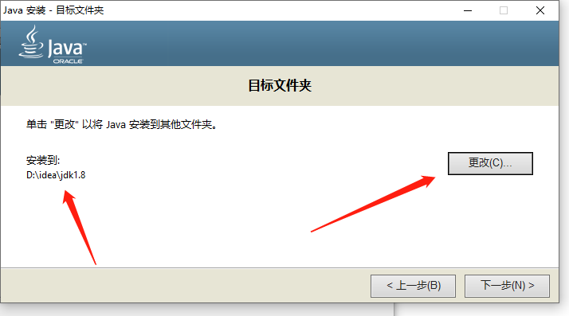

### 3、配置 jdk1.8 的环境变量

在电脑左下角搜索框输入：控制面板

控制面板 -> 系统与安全 -> 系统

高级系统设置 -> 高级 -> 环境变量

新建环境变量，变量名为 JAVA_HOME，变量值为 jdk 安装的路径

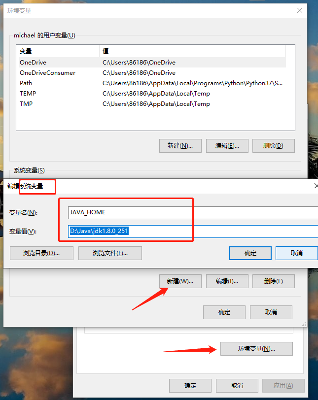

鼠标双击 Path，已安装过 jdk 的点击编辑，第一次安装的点击新建

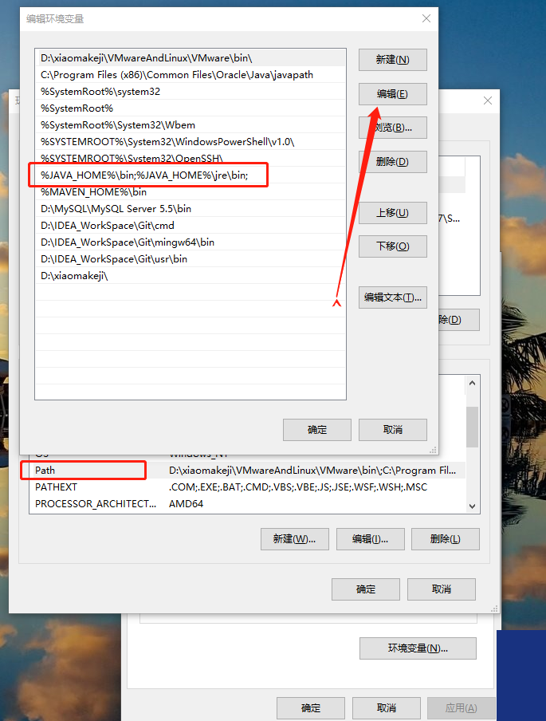

### 4、验证 jdk 是否配置成功

按 win+r 快捷键，打开命令窗口，输入 cmd 指令，点击确定

输入指令：

    java -version

若能查看到安装的 jdk 版本，则配置成功

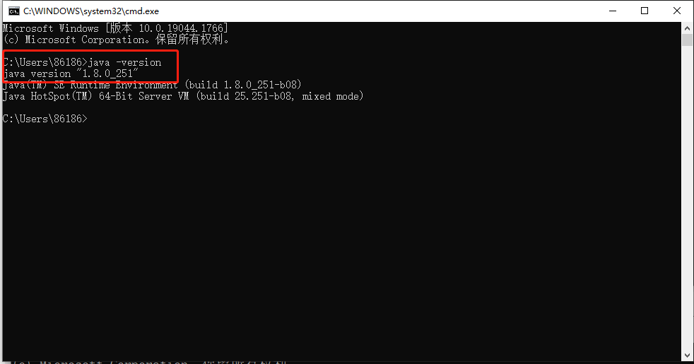

## Tomcat 下载安装及配置

### 1、Tomcat9 下载

Tomcat 官网地址：[https://tomcat.apache.org/](https://tomcat.apache.org/)

点击 tomcat 9 进入下载页面，再点击下载 64-Bit Windows zip（Win64）

找到下载的压缩包并解压

### 2、Tomcat 配置环境变量

首先在电脑左下角搜索框输入：控制面板

控制面板 -> 系统与安全 -> 系统。

高级系统设置 -> 高级 -> 环境变量

新建环境变量，变量名为 TOMCAT_HOME，变量值为 tomcat 解压后所在的路径

双击 Path，点击新建

### 3、验证 tomcat9 是否配置成功

按 win+r 快捷键，打开命令窗口，输入 cmd 指令，点击确定

输入指令：

    startup.bat

看能否正常启动

上图 tomcat 启动后乱码的问题：

打开解压后的文件：apache-tomcat-9.0.65 -> conf -> logging.properties

编辑文件：logging.properties

找到一行代码，如下所示：

    java.util.logging.ConsoleHandler.encoding = UTF-8

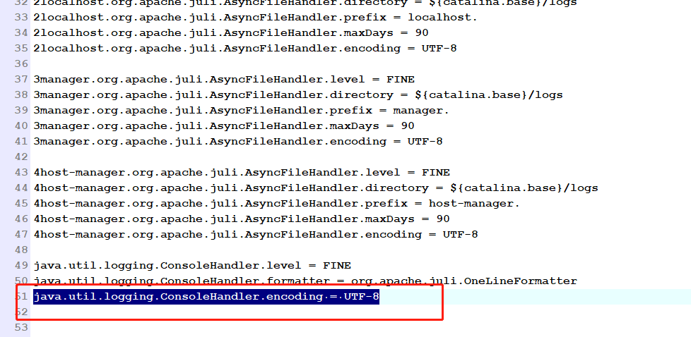

修改为：

    java.util.logging.ConsoleHandler.encoding = GBK

保存并重新启动 tomcat，输入指令：startup.bat，乱码问题得到解决。

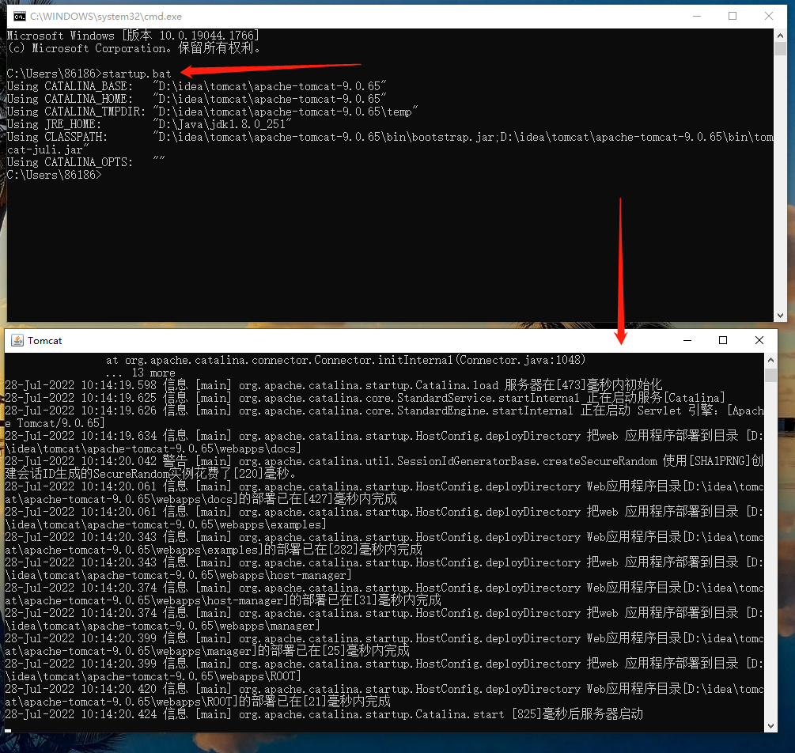

验证是否能正常访问，网页测试

注：上图网页测试时，下图输入指令：startup.bat 启动的 tomcat 命令界面不能关闭，关闭后无法访问

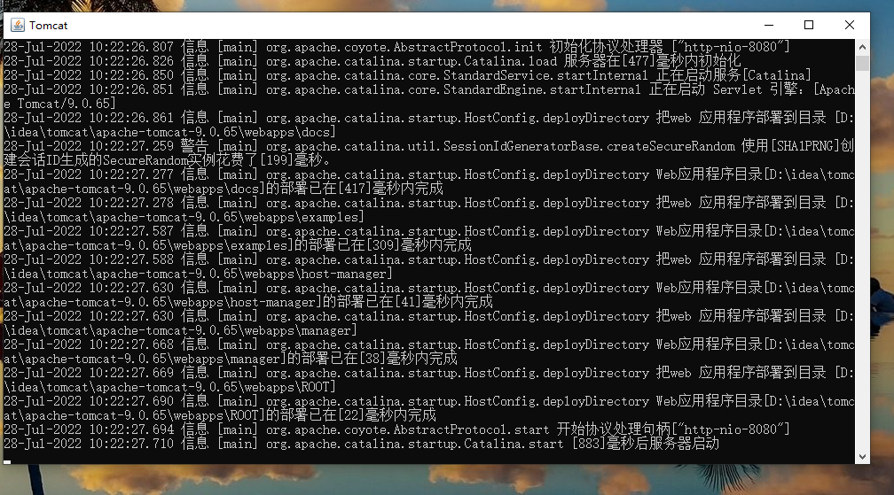

tomcat 默认端口号为 8080，若 8080 被占用或想更换访问端口号

编辑：apache-tomcat-9.0.65 -> conf -> server.xml

编辑 server.xml，找到 Connector 标签所在位置，如下图所示：

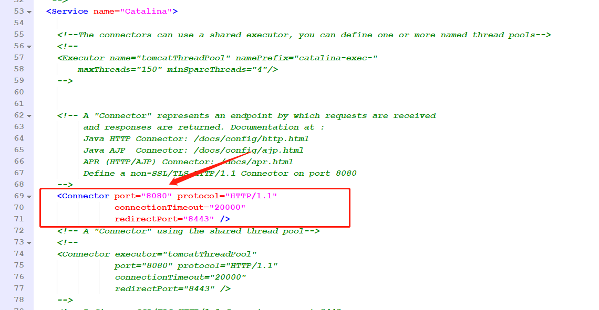

端口号修改：9527

重新启动 tomcat

网页测试，输入更改的端口号：9527

配置 tomcat 开机自启动

(1)找到 tomcat 文件的 bin 目录

    3.11 配置 tomcat 开机自启动
        (1)找到 tomcat 文件的bin 目录

        (2)输入 cmd

(2)输入 cmd

        (3)进入命令页面
        输入指令：service.bat install Tomcat

(3)进入命令页面

    输入指令：service.bat install Tomcat

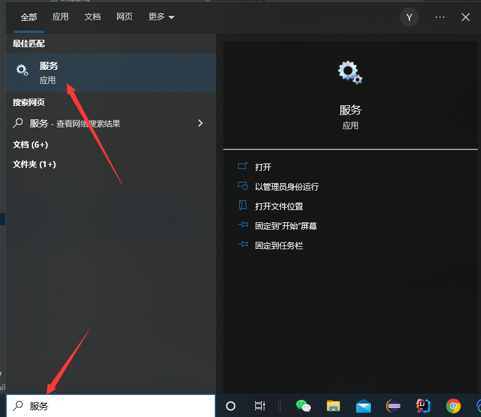

        (4)找到 tomcat
           单击鼠标右键，选择属性，把启动类型选择自动，点击确定，如下图所示： 

(4)找到 Apache Tomcat 9.0，单击鼠标右键，选择属性，把启动类型选择自动，点击确定，如下图所示：

## MYSQL 下载安装及配置

### 1、mysql5.7 下载

官网下载地址:[https://dev.mysql.com/downloads/mysql/](https://dev.mysql.com/downloads/mysql/)

进入官网下载页面，点击 Archives 进入选择版本页面

选择版本和下载

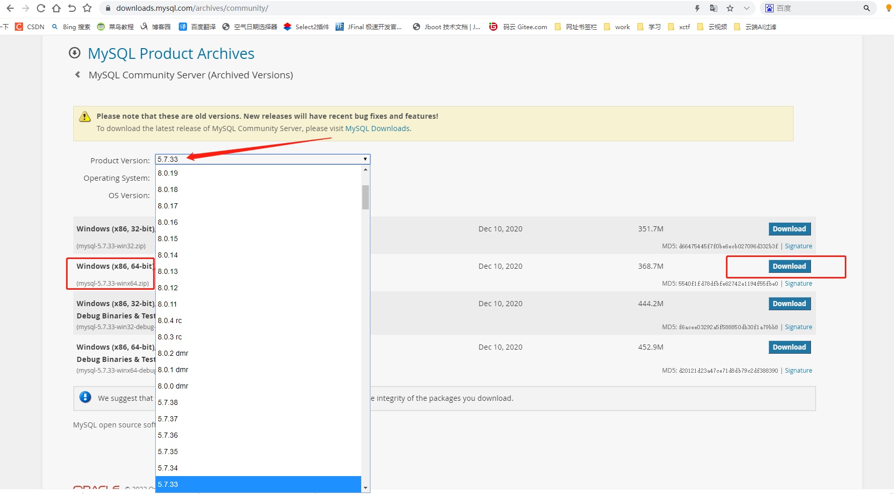

找到下载的压缩包，并解压

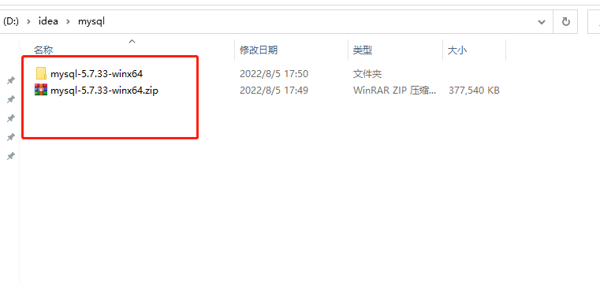

### 2、配置 mysql 环境变量

鼠标右键单击此电脑，选择属性，弹出设置页面

高级系统设置 -> 高级 -> 环境变量

系统变量 -> Path，双击打开点击新建，路径为 mysql 的安装路径，如下图所示：

mysql 安装（略）

## 3、Windows 环境准备完成，tomcat 部署

删除 tomcat 文件中 webapps 文件夹下所有文件；

    3.1 删除 tomcat 文件中 webapps 文件夹下所有文件，
        再把项目的 war 包放进去，并修改名称为 ROOT.war，注意是大写英文字母，
        ROOT 文件夹生成的两个方案：
        1、 你可以自己解压缩 ROOT.war ，就是一个 .zip 的压缩文件 
        2、 启动 tomcat 后，tomcat 自动帮你解压缩。
        如下图所示：
    

再把项目的 war 包放进去，并修改名称为 ROOT.war，注意是大写英文字母；

ROOT 文件夹生成的两个方案：
（1）你可以自己解压缩 ROOT.war ，就是一个 .zip 的压缩文件；
（2）启动 tomcat 后，tomcat 自动帮你解压缩。
如下图所示：

启动 tomcat，输入网站地址，按下回车键，如下图所示：

        
        部署成功

部署成功

