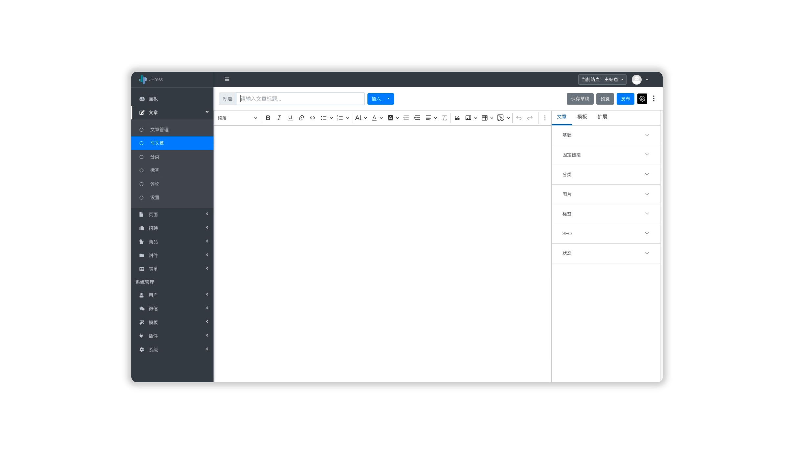

<h1 align="center" style="display: block!important;"> JPress </h1>

## JPress Brief introduction

JPress is a built -in station artifact developed by Java, an open source free `. Inspired by WordPress. At present, more than 10W+ websites have been built in JPress, including multiple government agencies, 200+ listed companies, the Chinese Academy of Sciences, Red Cross, etc.Essence

## JPress contact details
1. JPress Official website:[http://www.jpress.cn](http://www.jpress.cn)
2. Jpress official public account: JpressCN
3. QQ Group 1: 591396171
4. QQ Group 2: 288397536
5. WeChat communication group:

